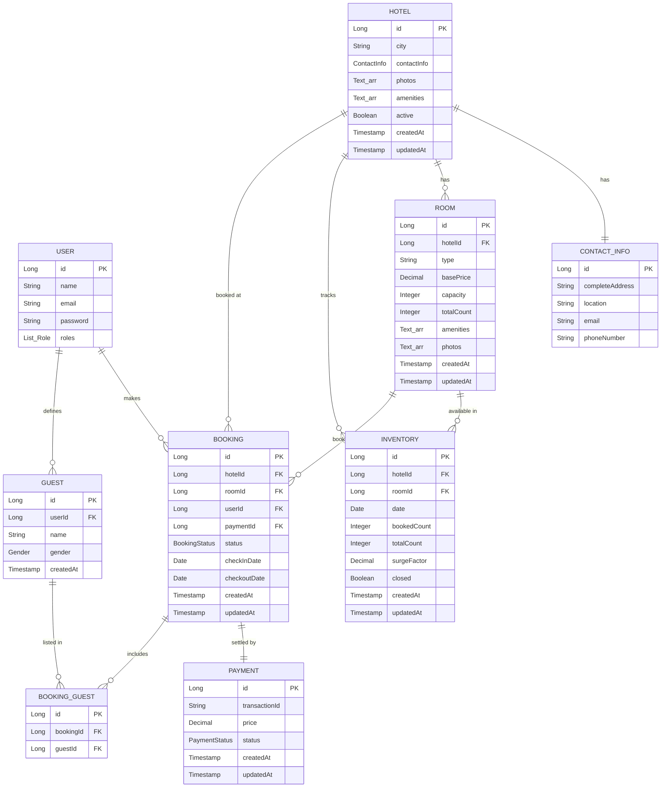

# Airbnb Clone — Hotel Booking Platform

> A full-stack hotel booking application (Airbnb-style) built with Java + Spring Boot and Angular. Guests search hotels by city and date range, reserve rooms backed by per-date inventory, add guests and pay; hotel managers manage hotels, rooms, inventory and bookings. Features dynamic, strategy-based pricing and role-based access.

> Built as a learning + portfolio project to go deep on Spring Boot, Angular and AWS deployment.

**Status:** 🚧 In development. Requirements, booking flow, schema, and API contracts are finalized; backend implementation is underway. Frontend (Angular) and deployment (AWS) are planned

---

## Repository Structure

This is a monorepo. Each part of the stack lives in its own top-level folder:

```
airbnb-clone/
├── backend/        # Spring Boot REST API (Java 21)  ← current focus
├── frontend/       # Angular web app                  (planned)
├── deployment/     # AWS / infrastructure & CI-CD      (planned)
├── docs/           # Requirements, ER diagram, API design notes
└── README.md
```

---

## Tech Stack

- **Backend:** Java 21 · Spring Boot 4.1.1 · Spring Web MVC · Spring Data JPA · PostgreSQL · Maven
- **Frontend :** Angular
- **Deployment :** AWS · Docker

---

## Core Concepts

- **Roles** — a `User` can be a **Hotel Manager** (creates and manages hotels, rooms, inventory, bookings) or a **Guest** (searches and books).
- **Per-date inventory** — availability is tracked per room per date via the `Inventory` table (`bookedCount` / `totalCount`), which is what makes availability checks and overbooking prevention reliable.
- **Dynamic pricing** — room price is computed per request from a `basePrice` adjusted by pluggable pricing strategies (see [Design Patterns](#design-patterns)).
- **Reservation lifecycle** — rooms are reserved, then confirmed on successful payment; unpaid reservations are released by a scheduled job.

---

## Data Model

> Full ER diagram and schema notes live in [`docs/`](../docs).



---

## Booking Flow

1. Guest searches hotels by city, date range, and number of rooms.
2. Browses the list of hotels matching the criteria.
3. Chooses a hotel and room type.
4. **Core booking flow:**
   1. Check whether the requested rooms are available for the date range (via `Inventory`).
   2. If available, reserve the rooms for that period.
   3. Allow the guest to add guest details to the booking.
   4. Proceed to payment.
   5. On payment success, update booking status to `CONFIRMED`; on failure, `FAILED`.

A scheduled job (`PATCH /api/v1/bookings/resetBookings`, every minute) releases reserved-but-unpaid rooms back to inventory.

---

## Design Patterns

**Strategy pattern — dynamic pricing.** Price is resolved through `getPrice(roomId, startDate, endDate)`, composed from:

| Strategy | Effect |
|---|---|
| `BasePricingStrategy` | Starting price |
| `OccupancyPricingStrategy` | Increase price when occupancy is above 80% |
| `UrgencyPricingStrategy` | Increase price for bookings within 7 days |
| `HolidaysPricingStrategy` | Increase price on holidays |
| `DiscountPricingStrategy` | Decrease price during a sale |

**Decorator pattern** — pricing strategies are stacked so each wraps and adjusts the result of the previous one.

---

## API Reference

### Auth
```
POST   /api/v1/auth/signup
POST   /api/v1/auth/login
POST   /api/v1/auth/verify
```

### Hotel Manager (admin)
```
POST   GET              /api/v1/admin/hotels
GET    PATCH  DELETE    /api/v1/admin/hotels/{hotelId}
POST   GET              /api/v1/admin/hotels/{hotelId}/rooms
GET    PATCH  DELETE    /api/v1/admin/hotels/{hotelId}/rooms/{roomId}
GET                     /api/v1/admin/bookings          ?hotelId&startDate&endDate&status
POST                    /api/v1/admin/reports           ?startDate&endDate
PATCH                   /api/v1/admin/inventory/{hotelId}/{roomId}/{date}
```

### Guest
```
GET    /api/v1/hotels/search         ?city&checkinDate&checkoutDate&numberOfRooms   (paginated)
GET    /api/v1/hotels/{hotelId}      ?checkinDate&checkoutDate&numberOfRooms
GET    /api/v1/hotels/{hotelId}/rooms/{roomId}
POST   /api/v1/bookings
POST   /api/v1/guests
PATCH  /api/v1/bookings              (body: guestIds[], paymentMethod)
POST   /api/v1/payments/{bookingId}
GET    /api/v1/bookings
GET    /api/v1/bookings/{bookingId}
PATCH  /api/v1/bookings/cancel
```

### System
```
PATCH  /api/v1/bookings/resetBookings    (cron — every 1 minute)
```

---

## Getting Started (Backend)

### Prerequisites
- Java 21+
- Maven (or the bundled `./mvnw` wrapper)
- PostgreSQL 14+

### Setup
1. Create a PostgreSQL database named `airBnb`.
2. Update `backend/src/main/resources/application.properties` with your DB username and password (don't commit real credentials — prefer environment variables).
3. Run the app:

```bash
git clone https://github.com/saurabh-biradar/airbnb-clone.git
cd airbnb-clone/backend
./mvnw spring-boot:run
```

The API will be available at `http://localhost:8080`.


## Documentation

- [`docs/Requirements_Notes.md`](../docs/Requirements_Notes.md) — functional requirements
- [`docs/Schema_ER_Diagram_AirBnb.pdf`](../docs/Schema_ER_Diagram_AirBnb.pdf) — database schema & ER diagram
- `docs/Requirements Gathering & API Design Notes.png` — full design board (flows, APIs, pricing)

---

## Author

**Saurabh Biradar** — [@saurabh-biradar](https://github.com/saurabh-biradar)
